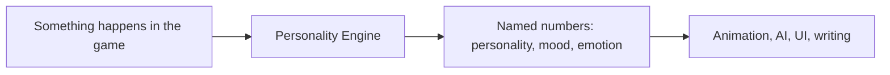

# Personality Engine

[](LICENSE)
[](https://github.com/RossSim/personality-engine/releases/latest)
[](https://github.com/RossSim/personality-engine/actions/workflows/test.yml)
[](https://github.com/RossSim/personality-engine/releases)

Personality Engine gives game characters a **mood, a personality, and short-lived feelings** that other systems can read.

You already have a game — or you are asking an AI assistant to help you make one. Characters take hits, hear bad news, keep promises, fail, meet friends, and get betrayed. This library does none of the walking, shooting, pathfinding, or dialogue writing. It sits beside those systems. You tell it what just happened. It hands back **named numbers**: how open this person is, how wound-up they are this minute, whether they are angry at someone. Animation, AI, UI, and writing use those numbers so the same companion, shopkeeper, or rival commander does not always behave the same way.

You keep the actions you already allow (flee, haggle, hold the door). The engine can **rank** those actions; it does not invent new ones. You turn on only the layers the fantasy needs. A bartender does not need childhood development stages. Anything you leave out is simply missing, not an error.

It is a small **C# library** (`netstandard2.1`), not a game engine and not a frozen psychology stack. Personality, mood, and emotion are the default layers. You add, replace, or omit the rest. Every piece cites a source. There is no language model inside the library. A game that uses a model can still host it; see [Language models as a host](docs/LANGUAGE_MODELS.md). It is **not** a clinical or psychometric instrument; see [Disclaimer](DISCLAIMER.md).

Where it goes in a game: [Applying it in games](docs/APPLICATIONS.md). What OCEAN, PAD, and OCC mean in ordinary language: [Personality, mood, and feeling](docs/OCEAN_PAD_OCC.md). Three short stories, including a playable HTML host: [Examples](docs/EXAMPLES.md). How to tick, save, and fold weights into an existing AI: [Hosting](docs/HOSTING.md). Beside a language model (the model stays outside): [Language models as a host](docs/LANGUAGE_MODELS.md).



Current library version: **0.6.1**. Downloads and notes: [Releases](https://github.com/RossSim/personality-engine/releases). History: [CHANGELOG.md](CHANGELOG.md). Where it is going: [Roadmap](docs/ROADMAP.md).

## Author's note

I always wanted more realistic behavior **over time** from NPCs: a companion who is still angry after the fight, a shopkeeper who remembers a slight, a rival who does not reset when you leave the room. Some larger titles build that kind of affect into the game. For a small team, the desire is easy and the implementation is not. The papers are scattered, the wiring is custom, and there is rarely a small library you can tick from the combat, dialogue, and AI you already have.

Personality Engine is that plug-in layer. It is not a game engine and not a studio's full NPC brain. You tell it what happened; it keeps named personality, mood, and feeling so animation, AI, UI, and writing can read them. It is open source (MIT) so you can tweak it, omit a layer, or replace a mapping to suit the fantasy.

I will not presume this is academically or professionally useful outside of game development. I wanted cited works so the content is not made up out of thin air. Every provider names a source. Numbers that are only game feel are labeled **project convention**. It is not a test and not a clinic; see the [Disclaimer](DISCLAIMER.md).

## Install

**NuGet package** (from a GitHub Release asset):

```bash
dotnet add package PersonalityEngine.Core --source /path/to/downloaded/nupkg-folder
```

Or add a `PackageReference` after placing `PersonalityEngine.Core.0.6.1.nupkg` in a local feed.

**DLL:** unzip the `PersonalityEngine.Core.*.zip` asset from the [latest release](https://github.com/RossSim/personality-engine/releases/latest) and reference `PersonalityEngine.Core.dll` (`netstandard2.1`). This repo is not a Unity project. A Unity adapter and a macOS playable (no Editor required) live in [NPC-demo](https://github.com/RossSim/NPC-demo).

**From source:**

```bash
git clone https://github.com/RossSim/personality-engine.git
cd personality-engine
dotnet test
dotnet run --project samples/AlmaConsole
dotnet run --project samples/AlmaTimeline
dotnet run --project samples/AlmaTimeline -- --serve
dotnet run --project samples/UtilityTint
dotnet run --project samples/SocialTint
dotnet run --project samples/Examples
dotnet run --project samples/Examples -- --serve
```

The console sample is a first **host**: it ticks the default composition and prints channels a game would read. `samples/AlmaTimeline` writes a 10s HTML chart (`samples/AlmaTimeline/index.html`). Serve with `--serve` to pick OCC events, intensity, and stagger, then Run Test. `samples/UtilityTint` shows a host Utility AI keeping Pick while PE tints three opaque action ids. `samples/SocialTint` does the same for `approach:{other}` / `avoid:{other}` after like and happy-for. `samples/Examples` plays three game stories (raid, shopkeeper visits, person-to-nation) from real ticks; serve with `--serve`. Samples are not providers and are not in the NuGet package.

## Quick start

```csharp
using PersonalityEngine;
using PersonalityEngine.Providers.Dyad;
using PersonalityEngine.Providers.Erikson;
using PersonalityEngine.Providers.Occ;
using PersonalityEngine.Providers.Ocean;
using PersonalityEngine.Providers.Pad;
using PersonalityEngine.Providers.Peterson;
using PersonalityEngine.Providers.Piaget;
using PersonalityEngine.Providers.Skinner;

var mood = AlmaComposition.Create(OceanTraits.GebhardExample);
mood.Tick(WorldEvent.Tick);
mood.Tick(HostEvents.NeedMet());

var meaning = PetersonComposition.Create(OceanTraits.GebhardExample);
meaning.Tick(new WorldEvent(OrderChaosMeaningProvider.AnomalyKind, 0.8f));

var operant = SkinnerComposition.Create(new[] { "forage", "idle" });
operant.Tick(new WorldEvent(OperantLearningProvider.EmitKind, 1f, "forage"));

var cognition = PiagetComposition.Create(CognitiveStage.ConcreteOperational);
cognition.Tick(new WorldEvent(PiagetEquilibrationProvider.EncounterKind, 0.2f));

var identity = EriksonComposition.Create(PsychosocialStage.IdentityVsRoleConfusion);
identity.Tick(new WorldEvent(EriksonPsychosocialProvider.ExploreKind, 1f));

var social = DyadComposition.Create();
social.Tick(HostEvents.Like("kin"));
```

Hosts compose only the providers they want. Missing channels are **absent**, not errors.

## Layers

| Layer | Role | First provider | Citation |
| --- | --- | --- | --- |
| Personality | Slow traits | Big Five / OCEAN | McCrae & Costa |
| Mood | Medium-term affect | PAD baseline + optional dynamics | Mehrabian; Gebhard 2005 |
| Emotion | Momentary affect | OCC (host-tagged types) | Ortony, Clore & Collins |
| Meaning (optional) | Known / unknown / knower | Peterson Maps of Meaning | Peterson (1999); CMT 2002 |
| Learning (optional) | Operant repertoire | Three-term contingency | Skinner (1953); Ferster & Skinner (1957) |
| Cognition (optional) | Schemas and stages | Equilibration | Piaget (1950, 1985) |
| Identity (optional) | Psychosocial crises | Eight ages | Erikson (1963, 1968) |
| Relationship (optional) | Pairwise liking | Dyad toward a named other | OCC 1988 (attitude); bumps/decay project convention |

Gebhard ALMA (2005) is the **first wiring** among personality, mood, and emotion — not the definition of the engine. Numeric game knobs are labeled **project convention** and are not attributed to a paper. What the letters mean without the papers: [Personality, mood, and feeling](docs/OCEAN_PAD_OCC.md).

Inspired by FAtiMA, built from scratch. Not a FAtiMA fork.

## Companion: Archetypes

[Archetypes](https://github.com/RossSim/archetypes) is a separate MIT repo for **preset catalogs** (profession, temperament, fantasy clan) that build a PE composition — `OceanTraits`, Piaget stage, operant seeds, enabled providers. It is not a second psychology stack and does not add providers to this library. Use it when you want cited defaults for NPC authoring instead of hand-seeding every character.

## Documentation

| Doc | What it is |
| --- | --- |
| [Charter](docs/CHARTER.md) | What is fixed vs modular |
| [Roadmap](docs/ROADMAP.md) | Shipped versions and intended next minors |
| [Applying it in games](docs/APPLICATIONS.md) | Where it goes in a game, in the same plain language as this page |
| [Personality, mood, and feeling](docs/OCEAN_PAD_OCC.md) | OCEAN, PAD, and OCC in ordinary language (who they are, how they are this hour, what this moment did) |
| [Examples](docs/EXAMPLES.md) | Three stories plus a tiny HTML host that plays real ticks |
| [Architecture](docs/ARCHITECTURE.md) | Pipeline, snapshot keys, composition |
| [Hosting](docs/HOSTING.md) | Idle tick, persist, host events, folding weights into a host chooser; Unity host is [NPC-demo](https://github.com/RossSim/NPC-demo) |
| [Language models as a host](docs/LANGUAGE_MODELS.md) | How a game that uses a model can tick, persist, and rank lines without putting an LLM in this library |
| [Citations](docs/CITATIONS.md) | Source registry |
| [Disclaimer](DISCLAIMER.md) | Not a test, not a medical device, MIT still governs |
| [Peterson](docs/peterson.md) · [Skinner](docs/skinner.md) · [Piaget](docs/piaget.md) · [Erikson](docs/erikson.md) · [OCC](docs/occ.md) · [Dyad](docs/dyad.md) | Academic review and in-module mapping |
| [Testing](docs/TESTING.md) | How to run the test suite and the console sample locally |
| [Releasing](docs/RELEASING.md) | How versions and GitHub Releases are cut |
| [Changelog](CHANGELOG.md) | Notes for every version |
| [Archetypes companion](https://github.com/RossSim/archetypes) | Preset tables and builders (separate repo) |

## Versioning and releases

Each published version has:

1. A `Version` in `PersonalityEngine.Core` (currently `0.6.1`)
2. A `CHANGELOG.md` section for that version
3. A git tag `vMAJOR.MINOR.PATCH`
4. A [GitHub Release](https://github.com/RossSim/personality-engine/releases) with those notes and downloadable `.nupkg` / `.zip` assets

Pushing a `v*` tag runs the release workflow. See [docs/RELEASING.md](docs/RELEASING.md).

## License

[MIT](LICENSE). Additional public notice: [Disclaimer](DISCLAIMER.md). The disclaimer does not change the MIT grant.

## Development

```bash
dotnet test
```

This repository is public and self-contained. Do not include private issue-tracker URLs, project keys, or ticket ids in commits, pull requests, issues, or releases. Do not name other private or internal projects.
