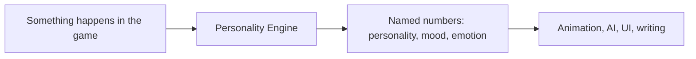
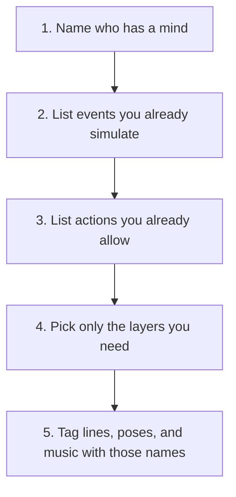
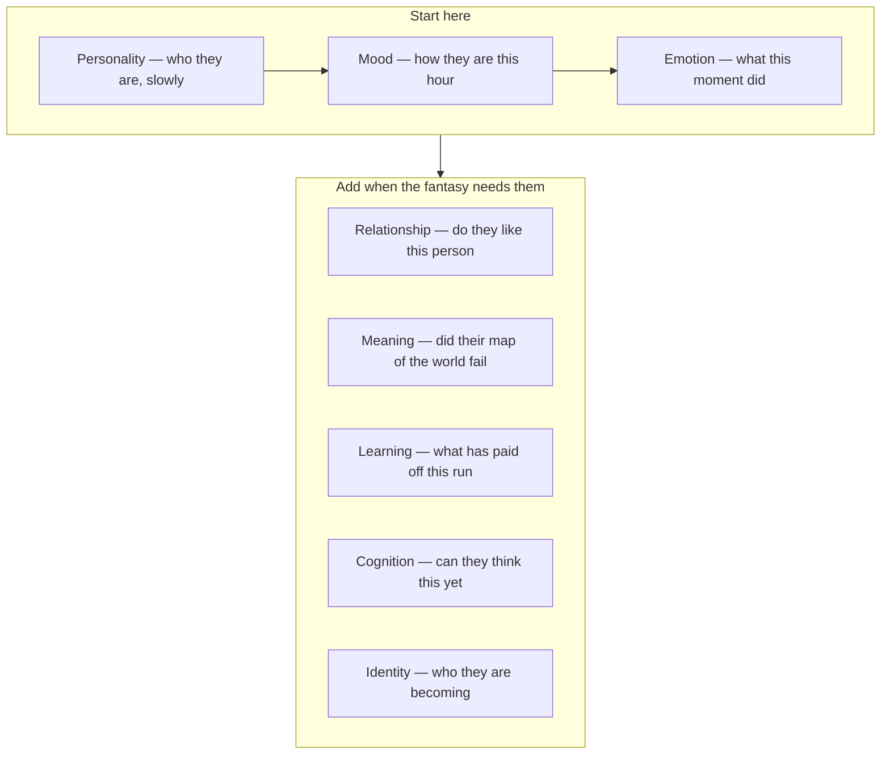
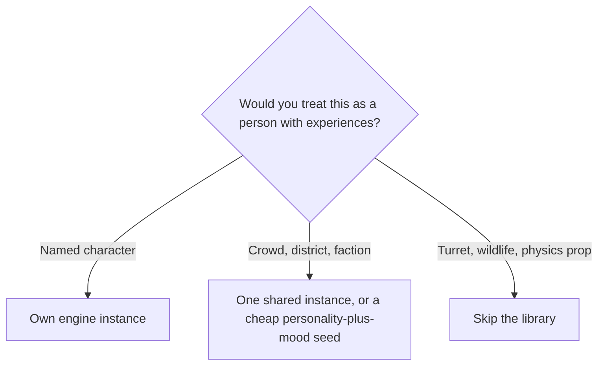
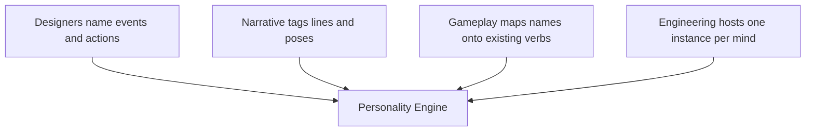

# Applying Personality Engine in game design

Personality Engine gives game characters a **mood, a personality, and short-lived feelings** that other systems can read.

You already have a game — or you are asking an AI assistant to help you make one. Characters take hits, hear bad news, keep promises, fail, meet friends, and get betrayed. This library does none of the walking, shooting, pathfinding, or dialogue writing. It sits beside those systems. You tell it what just happened. It hands back **named numbers**: how open this person is, how wound-up they are this minute, whether they are angry at someone. Animation, AI, UI, and writing use those numbers so the same companion, shopkeeper, or rival commander does not always behave the same way.

You keep the actions you already allow (flee, haggle, hold the door). The engine can **rank** those actions; it does not invent new ones. You turn on only the layers the fantasy needs. A bartender does not need childhood development stages. A child giving a puzzle does not need a training-schedule model. Anything you leave out is simply missing, not an error.

This page is for **designers, directors, programmers, and people using an AI to build a game**. It answers: when you sit down to make the game, where does this go, and what does the player notice? You do not need to write C# to follow it. Wiring, saving, and ticks live in [Hosting](HOSTING.md); how the pieces snap together lives in [Architecture](ARCHITECTURE.md).

## The design loop

1. **Name who has a mind.** A named NPC, a fireteam lead, a faction doctrine, a crowd-as-one, a player-character, or an off-screen cohort. Each gets its own engine instance (or a cheap shared archetype plus trait jitter).
2. **List events you already simulate.** Damage taken, deal closed, map revealed, promise broken, practice completed, evidence that will not fit. Those become ticks into the engine. You do not invent a second simulation.
3. **List actions you already allow.** GOAP actions, utility behaviors, dialogue moves, camera stances. The engine ranks them; it does not invent new verbs.
4. **Pick layers.** Slow who-they-are (personality), how-they-are-this-session (mood), what-just-happened (emotion), did-the-world-stop-making-sense (meaning), what-has-paid-off (learning), can-they-think-this-yet (cognition), who-are-they-becoming (identity).
5. **Author content against channels, not against if-else trees.** Tag lines, poses, and music stems with “high arousal,” “defend-belief,” “moratorium,” “hungry for the reinforcer.” Designers own the tags. The engine owns the numbers.

**Cost note.** Named heroes can run a full composition. Ambient crowds usually need only personality + mood, with Extraversion/Agreeableness jitter. Do not put a seven-layer stack on every background walker.

**What you do not get.** A personality test of the player. A large language model. A guarantee that OCEAN scores are “realistic people.” Numeric gains in the library are **project convention** unless a citation says otherwise. You are directing a citable affect stack, not shipping a clinic. Public legal notice: [`DISCLAIMER.md`](../DISCLAIMER.md).

## Which layer answers which design question

| If you are asking… | Reach for |
| --- | --- |
| Who is this person, slowly, across the whole game? | Personality (OCEAN; optional Stability/Plasticity) |
| How are they doing this hour or this day? | Mood (PAD) |
| What did this moment do to them? | Emotion (OCC) |
| Did their map of the world fail? | Meaning (order / chaos / knower) |
| What has actually paid off in *this* run? | Learning (operant strength, deprivation, SD) |
| Are they even able to think this thought yet? | Cognition (schemas, stages — host-set, not a clock) |
| Who are they becoming across a life or campaign? | Identity (psychosocial crisis — host-set) |
| Do they like *this* person, right now? | Relationship (pairwise liking) |

Theories disagree about causes. A host may run Skinner beside OCEAN; the engine will not paper over that. That is a design feature: a traitor who is high in Agreeableness *and* has been reinforced for betrayal is more interesting than either model alone.

Read the stack from the top when you are choosing layers. Personality is the slow floor. Mood and emotion are what most games need next. The second group is optional extras.

## Worked sketches

These are fictional games. They are not recommendations of setting. They show *where the plug goes*.

### *Ashline* — real-time strategy

The player fights rival commanders, not a bag of identical AIs. Each commander is an OCEAN seed plus a meaning stack. **Events you already have:** army lost, tech revealed, fog tile opened, supply cut. **Actions you already have:** attack, consolidate, scout, turtle, switch build.

A high-Openness, high-Plasticity commander treats a new unit type as something to explore: they scout and re-compose. A high-Stability commander treats the same reveal as an anomaly that threatens doctrine: they double down on the old composition (defend-belief) until losses punish that operant. Fog-of-war is not only a renderer. Unrevealed map is *unknown territory*; opening it is an anomaly tick for the scout lead, not for the economy manager.

Player-facing: two opponents on the same map play differently without extra behavior trees. Designers author one action set; weights choose.

### *Saltwind* — role-playing game

Companions, shopkeepers, and a coming-of-age lead share the same verbs (talk, follow, refuse, haggle, leave) and different compositions. **Events:** promise kept or broken, town saved, relic that contradicts the faith, training montage completed. **Actions:** loyalty dialogue, price modifier, leave-the-party, take the heretical quest.

The companion does not need a custom “betrayal flag.” A rupture event on the identity layer plus a mood drop is enough for the writer to hang three line variants: still-committed, moratorium (“I need to think”), withdraw. A child quest-giver on a preoperational stage cannot complete a conservation puzzle you designed for adults; that is a cognition constraint, not a low Intelligence stat. The merchant’s Agreeableness and current pleasure shift the haggle window. The paladin’s fidelity channel, not a scripted cutscene index, decides whether they will burn the heretical book or walk into the unknown with you.

### *Glass Corridor* — close-quarters shooter

A fireteam and a handful of named civilians, not a global “realism slider.” **Events:** round impacting nearby, buddy down, room cleared, hostage spotted. **Actions you already have:** hold, push, revive, freeze, flee, aid.

The stack lead’s dominance and arousal weight *push* vs *hold* after a failed entry. A conscientious, low-arousal marksman keeps the hold-breath action heavy when everyone else is panicking. A civilian medic with high Agreeableness and a recent “aid was reinforced” history (they helped and the hostage lived) will move to a downed player when a more neurotic civilian’s freeze weight wins. You are not simulating ballistics of fear. You are ranking the three civilian verbs you already animated.

### *Drift Catalog* — field-science internship (training)

Trainees collect specimens that sometimes *do not fit* last week’s schema. This is not a tool for grading lesson plans. It is a sim of people in the field. **Events:** data point that assimilates, data point that will not, mentor support, public presentation. **Actions:** repeat the old protocol, change the protocol, ask for help, fake the log.

Piaget’s disequilibrium is the gameplay: a stubborn intern keeps assimilating (play/repeat) until accommodation weight wins. Erikson’s industry vs inferiority (host-set to the trainee’s career stage) decides whether a failed presentation produces “practice more” or “I am not a scientist.” Operant history matters when faking the log paid off once. The player is a senior researcher who sees *behavior*, not a dashboard of theory names.

---

## Fifty uses

Each row is a design move: who holds an instance, what you already simulate, what the player should notice. Layers are the ones you would *reach for first*; you can always omit.

### Strategy and tactics

1. **Rival RTS commanders.** Same build list, different OCEAN seeds. Lost battles and revealed tech tick the engine; attack/consolidate/scout weights change. Personality + meaning.
2. **Fog scouts.** Opening unexplored tiles is unknown territory for the scout lead, not for the base manager. Scout vs return-to-base comes from meaning weights. Meaning + mood.
3. **Surrendered troops.** Captured units hold an identity instance at shame/doubt vs autonomy. Humane vs brutal treatment is support vs rupture; they desert or rejoin. Identity.
4. **Starved harvesters.** Cut the resource the gather operant was earning. Deprivation rises; raid vs farm weights flip without a new AI state. Learning.
5. **Broken doctrine.** A counter-unit falsifies the commander’s map. High Stability defends the old composition; high Plasticity explores a new one. Meaning + personality.
6. **4X first contact.** A new species is an anomaly for the empire’s meaning stack. The diplomatic verb set (probe, isolate, integrate) is already there; weights choose. Meaning.
7. **Court of a grand-strategy monarch.** The ruler is in intimacy vs isolation (host-set). Alliances are not only opinion numbers; they are approach vs withdraw on identity weights. Identity + mood.
8. **Tower-defense militia.** Civilians manning walls vs fleeing is dominance and pleasure after each leak. You already have both animations. Mood + personality.
9. **Autobattler drafter.** High Openness keeps odd synergies in the shop weight; high Conscientiousness repeats last week’s winning curve. Personality + learning.
10. **MOBA jungle pressure.** Extraversion and arousal weight invade vs farm after a kill. The verbs are already bound to hotkeys for the bot. Personality + mood.

### Role-playing and narrative

11. **Companion after a broken promise.** Rupture + mood drop. Writers tag three replies: stay, pause, leave. The engine picks the weight; the scene still plays from your dialogue. Identity + mood + emotion.
12. **Shopkeeper haggle.** Agreeableness and current pleasure shift the acceptable price band. No second economy sim. Personality + mood.
13. **Coming-of-age lead.** Host-set identity vs role confusion. Side quests that are “trying on faces” raise moratorium; joining a faction is commit. Identity.
14. **Child quest-giver.** Preoperational stage (host-set) cannot use a conservation or hypothetical clue you wrote for adults. The blocker is cognition, not a lockpick skill. Cognition.
15. **Cult and reformer.** Shared holy text; one NPC defends belief when the relic contradicts it, the other explores. Same evidence event, two meaning stacks. Meaning.
16. **Guild trainer.** Practice is an operant on a VR or FR schedule. Skipping training extinguishes; a lucky critical reinforces. The montage is already a scene. Learning.
17. **Paladin’s fidelity.** An identity commit channel, not a binary “fallen” flag, decides whether they destroy the heretical book. Identity + meaning.
18. **Visual-novel routes.** Candidate routes are actions. Snapshot (mood, intimacy, chaos) weights which branch an initiator NPC takes, including when the player is silent. Mood + identity.
19. **Unreliable witness (*Night Ledger*).** Neuroticism and arousal scramble what they volunteer; a concrete-operational witness cannot handle a hypothetical lineup you wrote for a scientist. Personality + cognition + mood.
20. **Heist crew (*Pact Nine*).** Each specialist is a trait seed plus a role. The anxious hacker’s freeze vs punch-in after an alarm is arousal and dominance, not a unique tree. Personality + mood.

### Shooters, stealth, and action

21. **Fireteam entry (*Glass Corridor*).** After a failed breach: hold vs push from the stack lead’s dominance and arousal. Same bound animations. Mood + personality.
22. **Named civilians in a raid.** Freeze, flee, aid. A medic who was reinforced for aiding will move; a high-Neuroticism neighbor will not. Mood + learning + personality.
23. **Designated marksman.** Conscientiousness plus low arousal keeps hold-breath and wait heavy while the room screams. Personality + mood.
24. **Guards who learn the player.** Catching the player reinforces search-this-room; never finding anyone extinguishes it. Patrols change over the mission without new waypoints. Learning.
25. **Battle-royale rotator.** Third-party gunfire is an anomaly plus arousal spike. Fight, loot, rotate are existing verbs. Meaning + mood.
26. **Fighting-game CPU greed.** Extraversion/Openness weights mix-up vs block after a successful read. You already have the move list. Personality + learning.
27. **Stealth mark’s safe map.** The first time the player is in the kitchen, chaos rises; after they check and leave, integrate. A rigid mark keeps clearing the same corner. Meaning.
28. **Vehicle gunner under fire.** Incoming hits tick arousal; dominance decides whether they stay on the gun or drop into the cabin you already rigged. Mood.

### Living worlds and management

29. **City-sim neighborhood.** One instance per district, not per citizen. Budget cuts and festivals are events; protest vs celebrate vs stay-home are district actions. Mood + personality (district “temper”).
30. **Space-colony night shift (*Red Mira*).** Cabin fever is PAD decay plus identity isolation. You already have “skip work” and “overwork.” Mood + identity.
31. **Theme-park guests.** Pleasure/arousal from wait times and ride intensity. Queue-jump vs sit vs leave. Mood. Cheap: one instance per party, not per guest.
32. **Hospital staff burnout.** Long shifts punish the “stay late” operant and drop pleasure. Call-in-sick vs heroics. Learning + mood.
33. **Farming-sim chores.** Watering and market runs are operants. A crop blight extinguishes the old routine; a bumper harvest reinforces it. NPCs look busy for reasons. Learning.
34. **God-game worshippers.** A miracle that fails is an anomaly. Sacrifice vs apostasy vs reinterpret-the-omen. Meaning.
35. **Reform-school sim.** Industry vs inferiority (host-set). Completed work is support; public shaming is rupture. Study vs withdraw. Identity + learning.
36. **Night dispatcher.** Alerts are arousal; successful routing reinforces the “take the call” operant. Freeze-the-board vs over-dispatch. Mood + learning.

### Training, education, and professional sims

These are about *people in a situation*, not about scoring a curriculum document.

37. **Field interns (*Drift Catalog*).** Data that will not fit last week’s protocol is a Piaget encounter. Repeat-protocol vs change-protocol vs fake-the-log. Cognition + learning.
38. **Flight trainee.** Host-set industry vs inferiority. A botched landing is a challenge; the instructor’s debrief is support. Practice vs freeze vs wash-out. Identity + mood.
39. **Language-practice booth.** Utterances are operants on a variable schedule of success. The learner who was punished for speaking goes quiet. Learning.
40. **Crowd-in-emergency trainer.** A few named agents in a station fire: aid, flee, freeze, as in the shooter civilian case, with deprivation (smoke, dark). Mood + learning + personality.
41. **Night-at-the-museum visitors.** An exhibit that contradicts schoolbook knowledge is disequilibrium for some and a confirm-map for others. Linger, skip, argue with the docent. Cognition + meaning.
42. **Surgical timeout team.** Roles have identity instances (fidelity to checklist vs hero-surgeon negative identity). A complication is an anomaly. Speak-up vs defer. Identity + meaning.

### Horror, thriller, social deduction

43. **House that stops fitting (*Vein*).** Rooms rearrange. That is not a jump-scare flag; it is chaos on the protagonist’s meaning stack. Search vs hide vs deny. Meaning + mood.
44. **Conspiracy board.** Pins that will not connect are Piaget encounters for the detective. Force-the-theory vs redo-the-board. Cognition + meaning.
45. **Social-deduction tells.** A lying NPC’s arousal and dominance leak into idle animation and chat delay. You already have those anims; the snapshot drives the blend. Mood + personality.

### Sports and racing

46. **Clutch vs choke (*Copper Sunday*).** Crowd noise is arousal. A high-Neuroticism striker’s shoot weight collapses; a high-dominance captain still takes the penalty. Mood + personality.
47. **Dirty racing.** Low Agreeableness plus high arousal after a bump weights ram vs clean-pass. You already simulate contact. Personality + mood.
48. **Halftime speech.** Coach support vs rupture events on the locker-room identity/mood instances. Second-half aggression is a weight shift, not a new playbook. Identity + mood.

### Tabletop, meta, and production

49. **VTT named NPCs.** The GM ticks “insult,” “gift,” “reveal” on a panel. The engine returns mood and action weights; the GM still speaks. Same loop as a video game, slower. Personality + mood + identity as needed.
50. **Dampen a painful social beat.** For an accessibility or content-note pass, you do not rewrite the scene: you clamp arousal and Neuroticism-driven withdraw on that NPC so the same dialogue tree plays less spiky. Personality + mood.

---

## NPCs, and who else

**Yes, NPCs.** That is the default. Named NPCs take a full or partial composition. Background NPCs take a cheap personality+mood seed. Factions can hold a meaning instance (“what our doctrine cannot survive seeing”). A crowd can be one instance if you only need a district mood.

**Player characters.** Use an instance when *the body* should feel different (wounded, grieving, newly titled), not to diagnose the player at the other side of the screen.

**Off-screen systems.** A market, a classroom cohort, a church, a fireteam you are not looking at. One instance, ticked from world events, read when the camera returns.

**Not every agent.** Wildlife, turrets, and pure physics props do not need this library. If there is no event you would be ashamed to show a psychologist as “an experience,” skip the stack.

## Production pattern

- **Designers** name events and candidate actions in the GDD, in the same vocabulary as combat and economy. They tag lines and anims with channel names (`mood.pad.arousal`, `meaning.peterson-maps.chaos`, `identity.erikson-psychosocial.moratorium`).
- **AI / gameplay** maps those names onto existing verbs and does not grow a parallel brain.
- **Narrative** writes against tags, then plays the game until a tick feels wrong; they ask for an event intensity change, not a new if-statement.
- **Engineering** hosts the library, one instance per mind, and never puts engine objects in the scene graph. This repo is not a Unity project; any C# host (including a game engine) consumes the `netstandard2.1` API.

If a later theory is needed (values, HEXACO), add a provider. Do not fork the library to invent a village-only personality system.

## See also

- [Charter](CHARTER.md) — what is fixed vs modular
- [Architecture](ARCHITECTURE.md) — pipeline and snapshot keys
- [Citations](CITATIONS.md) — which paper owns which knob
- [Peterson](peterson.md) · [Skinner](skinner.md) · [Piaget](piaget.md) · [Erikson](erikson.md) · [OCC](occ.md) · [Dyad](dyad.md) — academic mapping when a use above names that layer
