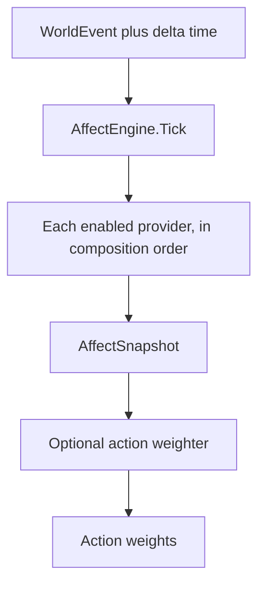
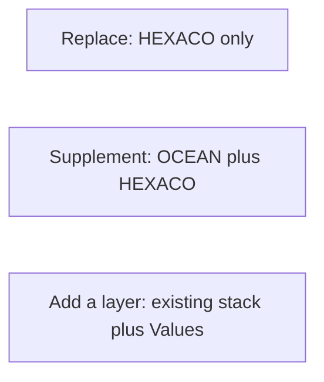
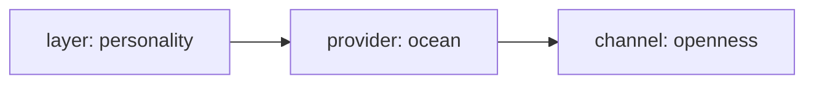
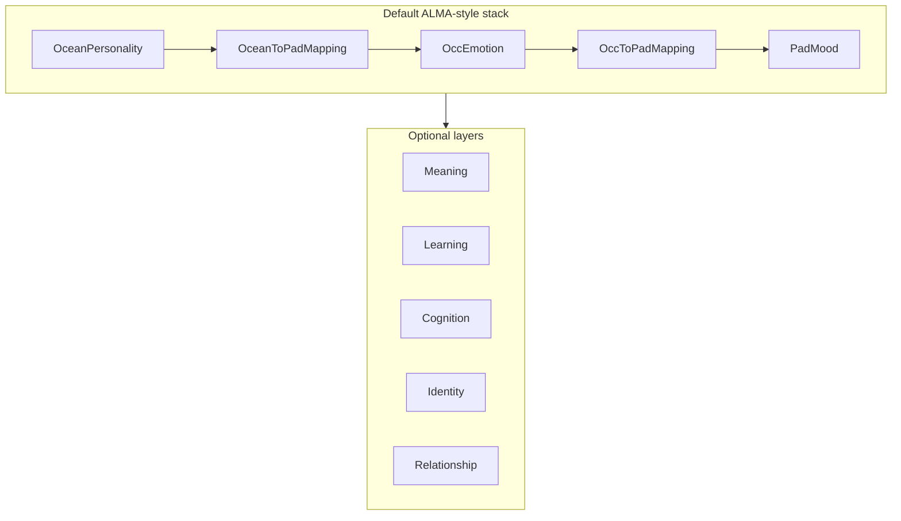

# Architecture

Charter: [`CHARTER.md`](CHARTER.md). Roadmap: [`ROADMAP.md`](ROADMAP.md). Design uses: [`APPLICATIONS.md`](APPLICATIONS.md). Citations: [`CITATIONS.md`](CITATIONS.md).

The library is a **composition root** plus **providers**. The core never hard-codes “personality is five OCEAN floats, mood is PAD, emotion is OCC.” Those are the first providers in the default composition.

## Pipeline

Hosts send typed events (and delta time). `Tick(dt)` is the idle path. `HostEvents` wraps common OCC kinds as named helpers. They read a snapshot and, if they asked for it, weights over candidate actions. Weights tint a host chooser; they do not replace Pick. They do not own the psychology. Save/load, events, and tint: [`HOSTING.md`](HOSTING.md).

## Providers

An `IAffectProvider` declares:

- a stable id (`ocean`, `pad-mood`, `occ`, `hexaco`, …)
- a **layer** (open set; well-known starters: `Personality`, `Mood`, `Emotion`)
- a **citation** (paper / book; project conventions flagged separately)
- `Contribute(event, dt, snapshot) → AffectDelta`

Providers are **additive**. Two personality providers can both run. A mapping (OCEAN→PAD) is itself a provider with its own citation, not hidden glue.

### Replace vs supplement

| Host intent | Composition |
| --- | --- |
| Replace OCEAN with HEXACO | HEXACO personality provider only |
| Supplement OCEAN | OCEAN + HEXACO (or Dark Triad, etc.), each namespaced in the snapshot |
| Keep OCEAN, change mood math | OCEAN + a different mood provider and/or mapping |
| Add a layer | e.g. a `Values` provider; existing providers keep working |

Downstream code looks up **named channels**. Missing channels are absent, not errors. Action weighters must tolerate a host that omitted mood or emotion.

## Snapshot

`AffectSnapshot` is a bag of named channels, not a fixed struct:

Examples: `personality.ocean.openness`, `mood.pad.pleasure`, `emotion.occ.anger`.

- key: `layer.provider.channel` (example: `personality.ocean.openness`, `mood.pad.pleasure`, `emotion.occ.joy`)
- value: typically a float in a documented range for that provider
- metadata: which providers ran this tick

Optional **projectors** may derive a convenience view (for example PAD) when the required inputs exist. A projector is cited; it is not a back-door requirement that every composition speak PAD.

## Default composition

Order:

1. `OceanPersonality` — McCrae & Costa Big Five
2. `OceanToPadMapping` — Gebhard ALMA 2005 baseline on `mood.pad.*`
3. `OccEmotion` — OCC types as `emotion.occ.*` (host-tagged eliciting events, including fortune-of-others)
4. `OccToPadMapping` — optional ALMA glue: OCC intensities → `mood.occ-to-pad.*` (coefficients are project convention)
5. `PadMood` — current PAD on `mood.pad-mood.*`, pulled toward the mapped baseline; adds the OCC overlay when present

Optional supplement ([`peterson.md`](peterson.md)):

6. `StabilityPlasticityProvider` — DeYoung, Peterson & Higgins (2002) metatraits
7. `OrderChaosMeaningProvider` — Peterson (1999) / CMT meaning layer (`meaning.peterson-maps.*`)
8. `PetersonMeaningWeighter` — explore vs defend vs integrate vs withdraw

Optional supplement ([`skinner.md`](skinner.md)) — **new `learning` layer**, not a personality provider:

9. `OperantLearningProvider` — Skinner (1953) / Ferster & Skinner (1957) operant strengths
10. `OperantWeighter` — strength × deprivation × SD

Optional supplement ([`piaget.md`](piaget.md)) — **new `cognition` layer**, not a personality or learning provider:

11. `PiagetEquilibrationProvider` — Piaget schemas, equilibration, host-set stages (`cognition.piaget-equilibration.*`)
12. `PiagetCognitionWeighter` — play vs imitate vs accommodate vs explore

Optional supplement ([`erikson.md`](erikson.md)) — **new `identity` layer**, not a personality, cognition, or learning provider:

13. `EriksonPsychosocialProvider` — eight ages, syntonic/dystonic ratio, ego identity (`identity.erikson-psychosocial.*`)
14. `EriksonIdentityWeighter` — explore vs commit vs care vs withdraw

Optional supplement ([`dyad.md`](dyad.md)) — **new `relationship` layer**, not an emotion provider:

15. `DyadProvider` — pairwise liking toward a named other (`relationship.dyad.liking:{id}`)
16. `DyadWeighter` — approach vs avoid for opaque `{other}` ids

The first green test is (1)+(2): Gebhard’s numeric example. `PadMood` and OCC are optional: omit them and those channels stay absent. The provider contract is `IAffectProvider` plus named-channel snapshots. Providers that keep private values implement `IStatefulProvider` so `AffectEngine.Export` / `Import` can round-trip them. Hosts serialize `AffectPersist` themselves. See [`HOSTING.md`](HOSTING.md).

## Out of scope for the core

- Unity scene objects or host-engine bindings
- LLM calls, prompt templates, or token I/O
- A FAtiMA port or binary compatibility with FAtiMA-Toolkit

Those may wrap this library later. They are not providers inside it.

This repository includes console hosts under [`samples/AlmaConsole`](../samples/AlmaConsole), [`samples/AlmaTimeline`](../samples/AlmaTimeline), [`samples/UtilityTint`](../samples/UtilityTint), [`samples/SocialTint`](../samples/SocialTint), and [`samples/Examples`](../samples/Examples). They are consumers, not providers.
