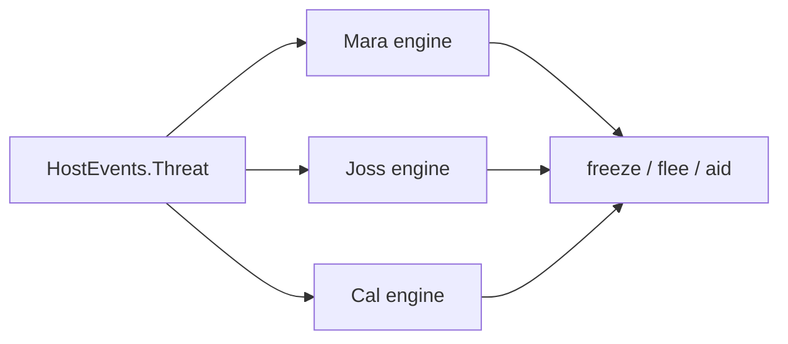
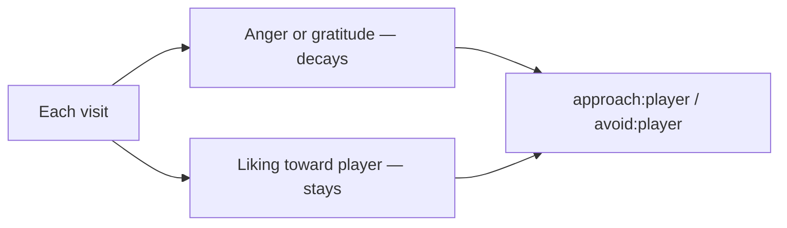
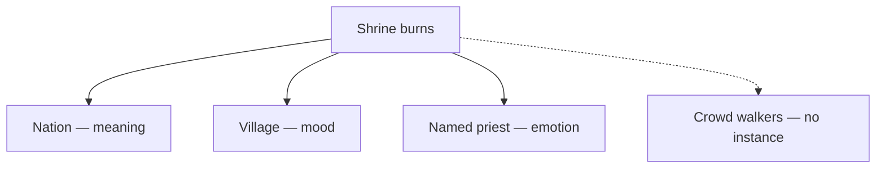

# Examples

Three short stories of Personality Engine in a game. Play the moving version:

```bash
dotnet run --project samples/Examples -- --serve
```

That host ticks real engines and serves [http://127.0.0.1:8766/](http://127.0.0.1:8766/). C# for ticks and save/load: [Hosting](HOSTING.md). Fifty design uses: [Applications](APPLICATIONS.md).

## 1. Three civilians, one raid

The square is raided. The game already animated freeze, flee, and aid. Three named people share one host event and three OCEAN seeds. Personality Engine ranks the verbs; the host still Picks.

**Host tagged:** `HostEvents.Threat(0.8)` on Mara, Joss, and Cal.

**Player notices:** Mara (high Agreeableness) runs to aid. Joss (high Neuroticism) freezes. Cal (conscientious, not a medic) flees.



## 2. Kind vs cruel visits

Bram the shopkeeper keeps a slow liking toward the player. Gratitude and anger flare and decay between visits. The host tags each trip. Liking is not inferred from a smile.

**Host tagged (kind):** `Like` + `Gratitude` + `NeedMet`. **Host tagged (cruel):** `Dislike` + `Anger` + `Harm`.

**Player notices:** Fair trade leaves haggle and greet on top. Insult and theft leave refuse and call-guard on top.



## 3. Person to nation

A shrine burns. That is one world fact and several minds. A nation can be a meaning instance (doctrine). A village can be one mood. A named priest can take anger. Crowd walkers skip the pulse.

**Host tagged:** nation `peterson.anomaly`; village `Harm`; priest `Anger(player)`. Walkers: nothing.

**Player notices:** Diplomatic verbs re-rank. The square goes quiet. The priest’s lines shift. Background walkers do not grow a cognition stack.


