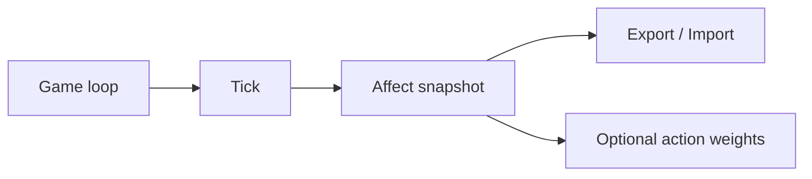
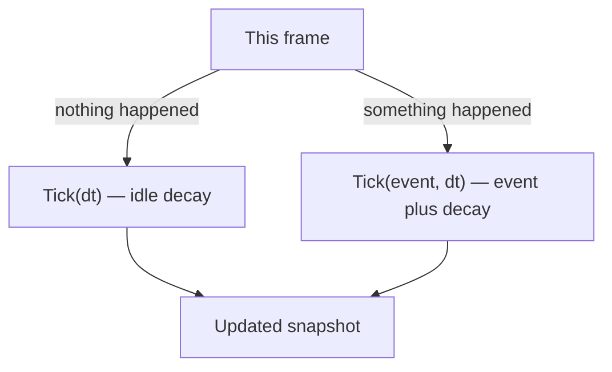
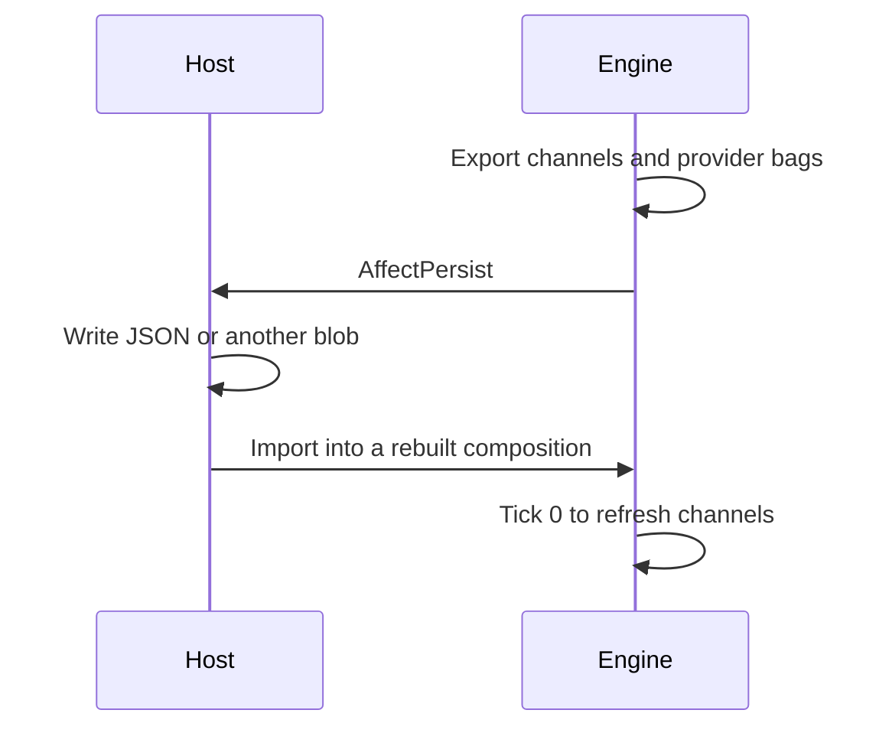
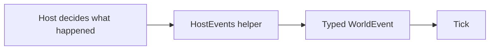
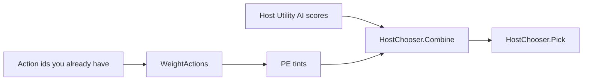

# Hosting Personality Engine

How a game (or other host) ticks, saves, and folds weights into an existing chooser. This is not a psychology paper. Numeric helpers here are **project convention** unless a citation says otherwise. A language model may sit **outside** as that host; it is not a provider. See [Language models as a host](LANGUAGE_MODELS.md).

Rebuild the same composition before `Import` (same traits, same providers, same decay rates). Persist does not store constructor arguments.



## Idle tick

`AffectEngine.Tick(dt)` decays without a host event. It is the same as `Tick(WorldEvent.Tick, dt)`. Call it from the game loop when nothing happened this frame.



```csharp
engine.Tick(deltaTime);                 // idle
engine.Tick(ev, deltaTime);             // event + decay
```

## Persist

`Export` / `Import` round-trip **snapshot channels plus per-provider internal bags**. Snapshot floats alone are not enough:



- `PadMood` keeps internal P/A/D. Snapshot `mood.pad-mood.*` already includes the OCC overlay. Restoring those as internal mood would double-count overlay on the next tick.
- `OccEmotion` decays a private intensity map. Restoring channels without that map freezes decay.
- `OperantLearningProvider` keeps strengths, ratio counters, SD, and deprivation privately.
- `DyadProvider` keeps pairwise liking privately.

`AffectPersist` is a POCO (`Version`, `Channels`, `Providers`). The core does not take a JSON dependency. Hosts may serialize it with `System.Text.Json` or another serializer.

Unknown provider ids and unknown bag keys are **ignored** on load. Extra snapshot channel keys are **kept** (the snapshot is an open bag). Missing bags leave that provider at constructor defaults. Non-finite floats are dropped.

`Import` is for **host-owned** saves. The core does not parse JSON or fetch blobs. If a host ever loads untrusted persist data (mods, other players), cap size before deserialize and treat the blob as untrusted input.

v1 shape:

```
Version: 1
Channels: { "layer.provider.channel": float, ... }
Providers: {
  "pad-mood": { "internal.pleasure", "internal.arousal", "internal.dominance", "seeded" },
  "occ": { "emotion.occ.joy": float, ... },
  "skinner-operant": { deprivation, optional sd, strength:* , ratio:*, next-vr:* },
  "dyad": { "relationship.dyad.liking:{otherId}": float, ... }
}
```

Providers that are not stateful (for example OCEAN) are reconstructed from the host’s composition, then rewrite their channels on the next tick.

```csharp
var blob = engine.Export();
// host writes JSON
other.Import(blob);
other.Tick(0f); // or Tick(WorldEvent.Tick)
```

## Host events

`HostEvents` is a **project-convention** catalog. It does not infer goals, standards, or liking. OCC helpers wrap kinds the default composition already understands. Like/dislike wrap the optional dyad provider:



| Helper | Kind | Typical host moment |
| --- | --- | --- |
| `NeedMet` | `occ.joy` | a need was satisfied |
| `Harm` | `occ.distress` | damage or goal failure |
| `Threat` | `occ.fear` | danger present |
| `ThreatPassed` | `occ.relief` | danger gone |
| `SelfCredit` | `occ.pride` | host attributes success to self |
| `SelfBlame` | `occ.shame` | host attributes failure to self |
| `HappyFor(other)` | `occ.happy-for` | desirable event for a liked other |
| `Pity(other)` | `occ.pity` | undesirable event for a liked other |
| `Resent(other)` | `occ.resentment` | desirable event for a disliked other |
| `Gloat(other)` | `occ.gloating` | undesirable event for a disliked other |
| `Like(other)` | `dyad.like` | host decided this other is liked more |
| `Dislike(other)` | `dyad.dislike` | host decided this other is liked less |
| `Anger(other)` | `occ.anger` | undesirable event attributed to another |
| `Gratitude(other)` | `occ.gratitude` | desirable event attributed to another |
| `Gratification` | `occ.gratification` | desirable event attributed to self |
| `Remorse` | `occ.remorse` | undesirable event attributed to self |

Fortune-of-others helpers take the other id as `WorldEvent.Target`. They do **not** read liking. The host already chose HappyFor vs Gloat. Compound helpers work the same way: `Anger` / `Gratitude` keep the other as `Target`; `Gratification` / `Remorse` are self-attribution. None of these infer from dyad liking or from pairing distress with reproach.

```csharp
engine.Tick(HostEvents.NeedMet());
engine.Tick(HostEvents.Threat(0.7f), deltaTime);
engine.Tick(HostEvents.HappyFor("kin"));
engine.Tick(HostEvents.Gloat("rival", 0.8f));
engine.Tick(HostEvents.Like("kin"));
engine.Tick(HostEvents.Anger("rival"));
engine.Tick(HostEvents.Gratitude("kin"));
```

Hosts may still send `new WorldEvent(OccEmotion.JoyKind, 1f)` directly.

## Utility-AI tint

`WeightActions` is a **tint**, not a second brain. The host Utility AI keeps `Pick`. Dual choosers (host Pick and a PE weighter both selecting actions) will fight.



```csharp
var bases = /* host considerations, opaque ids */;
var tints = engine.WeightActions(new[] { "meet-need", "role-work", "wander" });
var finals = HostChooser.Combine(bases, tints); // base + 0.35 * tint
var pick = HostChooser.Pick(finals);            // host still decides
```

`UtilityTintWeighter` maps PAD/OCC onto those three ids. Coefficients are project convention. Missing channels score 0 and must not throw.

Runnable sample: `dotnet run --project samples/UtilityTint`. It starts with host bases that prefer `role-work`, then a threat pulse flips Pick to `meet-need`.

`DyadWeighter` maps dyad liking and fortune-of-others onto `approach:{other}` / `avoid:{other}`. Missing channels score 0 and must not throw. Like OCC, the weighter does not pick.

Runnable sample: `dotnet run --project samples/SocialTint`. It starts with host bases that prefer `avoid:rival`, then a like pulse on `ally` flips Pick to `approach:ally`.

## Unity

This repository is not a Unity project. Games still consume `netstandard2.1`. A public Unity adapter (`NpcMind`, host events, persist) and a macOS playable — **no Unity Editor required** if you download that repo’s Release `.app` — live in [NPC-demo](https://github.com/RossSim/NPC-demo). It seeds minds from [Archetypes](https://github.com/RossSim/archetypes) catalog ids and ticks `HostEvents` the same way the console samples do.
