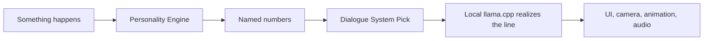
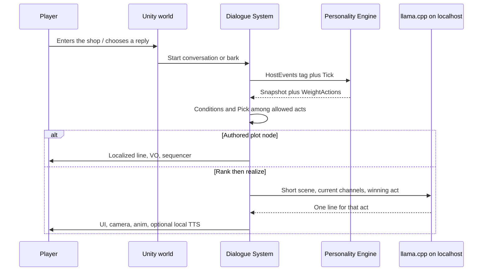
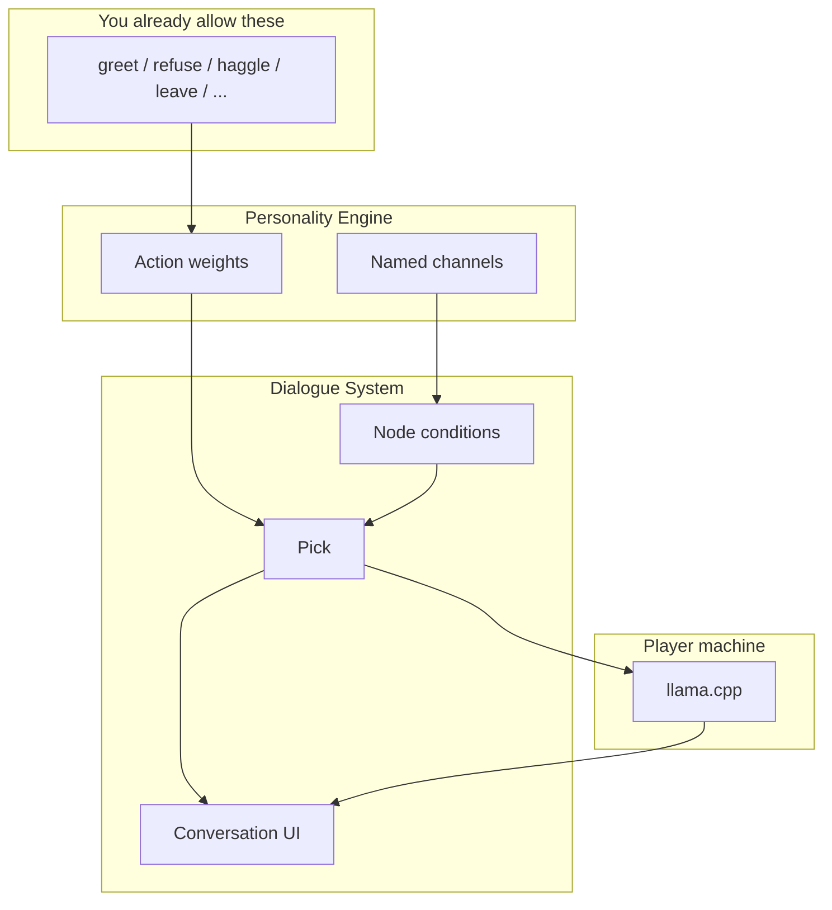
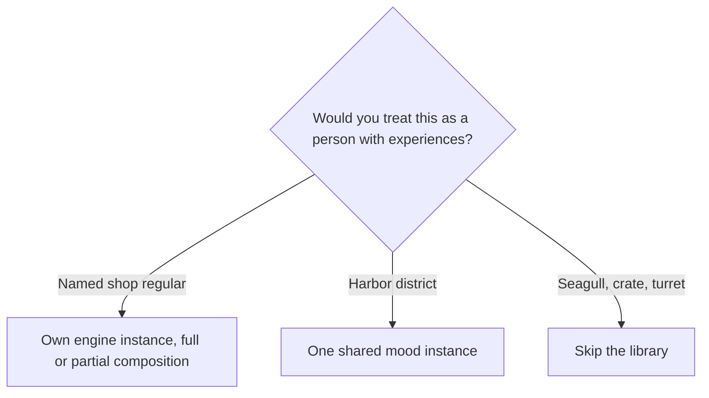
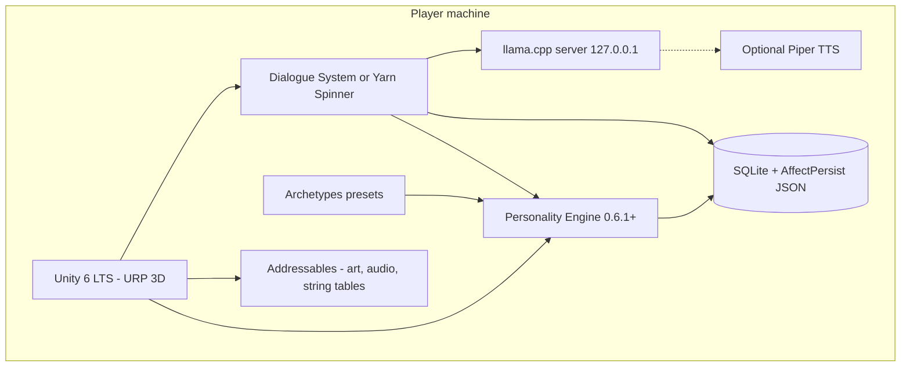

# Lampwick — a Unity conversation host

A **fictional** game concept for a host that already has Personality Engine, Archetypes, and a language model. It is not a product commitment and not a Unity project inside this repository. It shows *where the plug goes* when NPCs should feel like people over time, speak in natural lines, and never send a prompt off the player’s machine.

This library still does none of the walking, cameras, or dialogue writing. [Applying it in games](APPLICATIONS.md) is the design loop. [Language models as a host](LANGUAGE_MODELS.md) is the three-plug pattern (tag, state, writer). Lampwick is that pattern as a whole game: **rank a speech act, then realize the line locally**.



Public legal notice: [`DISCLAIMER.md`](../DISCLAIMER.md). The model is entertainment middleware sitting **outside** this library. It is not a clinic.

## Pitch

You inherit a lantern shop in a small harbor town. People come in with weather, debts, gossip, and requests. You talk. That is the game.

Eight to twelve **named** people keep a mind between visits. A shopkeeper who was insulted yesterday is still cool today. A sibling who watched you keep a promise greets you differently. Crowd walkers share a district mood and do not grow a seven-layer stack.

Combat, crafting trees, and a custom conversation UI are out of scope for the first vertical slice. The work is **story, character, and the wiring** among four already-built pieces:

| Piece | Owns | Does not own |
| --- | --- | --- |
| **Dialogue System for Unity** (or Yarn Spinner) | Conversation UI, barks, localization, sequencer, quest/conversation save, allowed topics | Psychology; free-form ranting |
| **Personality Engine** | Affect over time: personality, mood, emotion, optional extras | Lines, prompts, tokens |
| **Archetypes** | Starting mind seeds (profession, temperament, clan) | Runtime ticks |
| **Local LLM** (llama.cpp on localhost) | Realizing a **chosen** speech act as a sentence | Picking the act; remembering every punch |

One chooser. Personality Engine **tints**; Dialogue System **Picks**; the model **writes that Pick**. Two brains that both Pick will fight. See [Language models as a host](LANGUAGE_MODELS.md).

## What the player notices

- The same innkeeper is not a reset NPC when you return from the docks.
- Silence is a beat: idle `Tick(dt)` still moves mood while you say nothing.
- Critical plot lines are authored and voiced. Everyday texture (greetings, asides, how a refusal is phrased) can be generated **inside** a ranked move.
- Nothing in the prompt leaves the machine. There is no account, no cloud completion, no “memory” vendor.

## The conversation beat

Every talk uses the same loop. Writers author **speech acts** (greet, ask-news, offer-help, refuse, haggle, confess, accuse, forgive, gift, wait-silent, leave). They do not author a unique tree per mood unless they want a plot gate.



**Tag.** Combat, a sequencer command, a designer, a cheap classifier, or (rarely) the model maps “what just happened” onto a `HostEvents` helper. The engine does not read the sentence. Player insult → `HostEvents.Anger("player")`. Gift → `HostEvents.Gratitude("player")` plus `Like("player")` if the host decides liking moved. Fortune-of-others still needs **you** to choose HappyFor vs Gloat.

**State.** `Tick` on events and on idle frames. `Export` / `Import` at save boundaries so the model is not the memory of every punch. Snapshot floats alone are not a full save: [Hosting](HOSTING.md).

**Writer.** Candidate speech acts are action ids Dialogue System already allows. `WeightActions` tints them. The dialogue database Picks (Lua/C# conditions plus weights). Then either play authored text, or ask the local model to write **only** that move.



## Who has a mind



| Cast | Composition | LLM? |
| --- | --- | --- |
| 8–12 named people | Archetype preset → PE instance (personality + mood + emotion + dyad toward player; extras only if the fantasy needs them) | Rank-then-realize on everyday nodes |
| Player body | Optional instance when *the body* should feel different (exhausted, grieving). Not a test of the human at the keyboard. | No |
| District / weather gossip | One cheap personality+mood seed | Barks from a tiny act list, or authored only |
| Crowd walkers | Skip, or share the district seed | No |

Cost note from [Applications](APPLICATIONS.md): do not put a seven-layer stack on every background walker.

### Starter named cast (fiction vs knobs)

Each row splits what the player sees from the cited knobs. Archetypes is the catalog; until that package ships, the Unity host keeps the same shape as hand-authored JSON.

| Id | Fiction | Knobs (first reach) |
| --- | --- | --- |
| `mara-innkeeper` | Keeps the common room; notices slights | High Agreeableness; dyad toward regulars; PAD pleasure tracks how the room has been treated |
| `bram-chandler` | Sells wick and oil; remembers a cruel visit | Shopkeeper sketch in [Examples](EXAMPLES.md): like/dislike + gratitude/anger |
| `joss-lookout` | Watches the bar; startles | High Neuroticism; fear/relief from harbor events |
| `cal-clerk` | Harbor paperwork; keeps the hold | High Conscientiousness; low arousal keeps “wait” heavy |
| `wren-scholar` | Hypotheticals about the failing light | High Openness; Piaget formal operational; meaning layer if the light “stops fitting” |
| `ned-fisher` | Slow to warm; trained to the tide | Temperament band (slow-to-warm) + operant seeds on `fish` / `idle` |
| `ilya-sibling` | Shared childhood; identity vs role | Erikson identity vs role confusion (host-set); rupture/support from promises |
| `harbor-light` | Not a person | Skip PE. The *nation/doctrine* move from [Examples](EXAMPLES.md) can sit on a town meaning instance if the light’s failure is an anomaly for the harbor, not for a crate. |

## Tech stack

Everything below runs **on the client**. There is no game server and no cloud model. Optional first-run download of a GGUF is still the player’s disk.



### Game engine and Unity modules

| Piece | Choice | Why |
| --- | --- | --- |
| Engine | **Unity 6 LTS** (or 2022.3 LTS if a plugin lags) | C# host for `netstandard2.1` PE; this repo stays a library. Unity adapter patterns: [NPC-demo](https://github.com/RossSim/NPC-demo). |
| Render | **URP** | One town, baked lighting, cheap day/night; avoid HDRP cost for a conversation game. |
| Camera | **Cinemachine** | Conversation cameras (over-shoulder, two-shot) without a custom rig. |
| Input | **Input System** | Keyboard/mouse + gamepad for dialogue navigation. |
| Text | **TextMeshPro** | Dialogue System / Yarn already expect it. |
| Navigation | **AI Navigation (NavMesh)** | Walk the town, enter shops, sit. Not a combat AI. |
| Animation | **Animator** + **Animation Rigging** | Look-at during talk; blendshapes from PAD/OCC. |
| Timeline | Unity **Timeline** | Scripted arrivals and plot gates; still ticks PE on signals. |
| Content load | **Addressables** | Characters, scenes, audio; not a database. |
| Localization | Unity **Localization** | Authored plot strings. Generated lines stay in the session language. |

### Dialogue — do not invent the mechanic

| Path | License | Use when |
| --- | --- | --- |
| **Dialogue System for Unity** (Pixel Crushers) | Paid Asset Store | You want conversation UI, barks, sequencer, Lua/C# conditions, alerts, and save in one module. Preferred if the budget allows. |
| **Yarn Spinner 3** | MIT | Free path with the same split: Yarn owns nodes and UI; PE tints; LLM realizes. |
| **Ink** (inkle) | MIT | Strong for authored plot; weaker built-in bark/sequencer. Pair with Cinemachine and your own bark list. |

**Fungus** is free but a weaker long-term fit for save, localization, and barks. Do not write a custom node editor in the first year.

Dialogue System (or Yarn) owns:

- Who can talk about what (topics, once-flags, quest gates)
- Player choice UI and NPC initiator when the player is silent
- Barks in the square
- Sequencer: face toward player, camera cut, `Tick` PE, play VO
- Persistence of conversation state (which nodes fired)

It does **not** own OCEAN, PAD, OCC, or token I/O.

### Personality and presets

| Piece | Role |
| --- | --- |
| Personality Engine 0.6.1+ | `AffectEngine` per named mind. Default ALMA-style stack; add dyad toward `player`; add meaning/identity only for the sibling and the scholar. |
| Archetypes | `MindPreset` → constructor args. Public catalog: professions and fantasy clans, not real-world race tables. Skeleton today: [Archetypes](https://github.com/RossSim/archetypes). Until 0.1, author JSON in the same shape. |
| NPC-demo | Reference Unity host and playable. Copy hosting patterns; do not fork this library into the game. |

### Local language model

Vendor clients and prompt templates stay **out of this repository**. The game owns the call.

| Piece | Choice | Why |
| --- | --- | --- |
| Runtime | **llama.cpp `llama-server`** on `127.0.0.1` (OpenAI-compatible) | Sidecar: crash isolation, GPU lifecycle, swap models without restarting Unity. Unity talks HTTP to localhost only. |
| Dev convenience | Ollama or LM Studio, still bound to localhost | Fine for authors. Ship path is llama.cpp + a pinned GGUF. |
| In-process later | LLamaSharp | Only if the sidecar is operationally worse. Not required for the vertical slice. |
| Not for lines | Unity Sentis | Tiny ONNX classifiers for tagging (insult vs gift) are optional. Do not ask Sentis to write dialogue. |
| Models | 8B-class Q4_K_M as default (e.g. Llama 3.1 / 3.2 Instruct); 3B-class for CPU/low VRAM | Instruct models follow “write only this speech act.” Respect each model’s license when shipping. |
| Context | Short: speaker, listener, this beat, a handful of channels, winning act, one-line legend | Do not send the combat log or the full persist blob. [What to send](LANGUAGE_MODELS.md). |
| Fallback | Authored line for that act | If the sidecar is missing, cold, or over-budget on tokens, play the database text. The game must be completable with generation off. |

**First-run:** detect RAM/VRAM, recommend a GGUF tier, verify SHA-256, never upload prompts. Settings store the binary path and context length in PlayerPrefs or a local JSON config — not in PE.

### Data on disk (no server database)

| Store | Contents |
| --- | --- |
| **SQLite** (one file per save slot) | Player position, clocks, which named minds exist, conversation summary rows (rolling 3–5 sentences for the *next* prompt only). |
| **AffectPersist** JSON per mind | PE `Export` blob. Rebuild the same composition before `Import`. [Hosting](HOSTING.md). |
| **Dialogue System / Yarn save** | Node visits, once-flags, relationship variables that are *plot* (not mood). Mood lives in PE, not a DS variable named `anger`. |
| **String tables** | Authored plot and UI. |
| **Archetype catalogs** | JSON or embedded presets. |
| **PlayerPrefs / config JSON** | Graphics, volumes, LLM path, generation on/off. |

Do not use a cloud database. Do not treat the snapshot as the save file. If a host ever loads untrusted persist (mods), cap size and treat it as untrusted input.

### 3D visual

| Piece | First slice | Later |
| --- | --- | --- |
| Town | One modular harbor (KayKit / Synty / Quaternius-class kit) | Second interior |
| Named people | Distinct outfits on a shared humanoid; 8–12 | Unique sculpts |
| Faces | Blendshapes driven by `mood.pad-mood.pleasure` / `arousal` / `dominance` and a peak OCC | More visemes |
| Lip sync | **uLipSync** (free) or Dialogue System visemes on authored VO | Local TTS visemes |
| Crowd | Shared mesh, no PE, or district seed only | — |
| Lighting | Baked + simple time-of-day | Mood-tinted fill as a *subtle* grade, not a disco |

### Audio

| Bus | First slice | Notes |
| --- | --- | --- |
| Mixer | Unity Audio Mixer: Voice, SFX, Music, Ambience | FMOD only if the mixer runs out of road |
| Voice | Authored VO on plot nodes | Optional **Piper** (or similar local TTS) for realized barks only |
| Music | Two stems (calm / tense), crossfade on district arousal or the current speaker’s PAD | Tag stems with channel names, same as [Applications](APPLICATIONS.md) |
| Ambience | Harbor loop, interior beds | Sequencer ducking during conversation |
| SFX | Doors, footsteps, wick, coins | Existing verbs; PE does not play sounds |

### Platforms and privacy

- Desktop first (Windows, then macOS/Linux). The sidecar and GGUF are the hard part on consoles; do not promise Switch.
- Offline. Generation off is a first-class mode.
- No analytics of prompts. Crash reports must not include conversation text or snapshot dumps.
- Ship the PE disclaimer in the credits: not a test, not a medical device.

### What you do not buy or build yet

- Multiplayer (presets are local; Archetypes does not handle netcode)
- A second AI that also Picks (GOAP/Utility fighting Dialogue System)
- Cloud LLM “fallback when local is slow” — that breaks the privacy pitch
- A clinic, a Big Five test of the player, or MBTI
- Race or ethnicity presets

## Project structure

This library stays `netstandard2.1`. The game is a **separate Unity repo**. NPC-demo remains the small public adapter, not the campaign.

```text
personality-engine/          # this repo — middleware, not the game
archetypes/                  # preset catalogs (companion repo)
NPC-demo/                    # Unity adapter + playable slice

Lampwick/                    # game repo (Unity)
├── Assets/
│   ├── _Game/
│   │   ├── Characters/      # prefabs: archetype id, PE host, DS actor
│   │   ├── Dialogue/        # conversations, barks, speech-act catalog
│   │   ├── Prompts/         # TextAsset templates (game-owned, not PE)
│   │   ├── Presets/         # MindPreset JSON until Archetypes NuGet
│   │   ├── Scenes/          # Boot, Town, ShopInterior
│   │   ├── UI/              # pause, settings (model path, gen on/off)
│   │   ├── Audio/
│   │   └── Art/
│   ├── Plugins/
│   │   └── PersonalityEngine/   # nupkg/dll, never a fork of providers
│   └── Pixel Crushers/          # or Yarn Spinner package
├── Packages/manifest.json
├── ProjectSettings/
├── StreamingAssets/
│   ├── llm/                 # README + hash list; GGUF gitignored or LFS
│   └── licenses/            # model + font + kit licenses
├── Tools/
│   └── llama/               # pinned llama-server binaries per OS
└── docs/
    ├── GDD.md
    ├── SPEECH_ACTS.md       # the only verbs the model may realize
    └── CAST.md              # fiction vs knobs vs citations per NPC
```

Host scripts (conceptual, not shipped here): one `AffectHost` per named mind, a `DialogueBridge` that maps sequencer signals → `HostEvents` and snapshot channels → Lua/Yarn conditions, a `LocalLlmClient` that posts to localhost and times out to authored text.

## Build steps

Each step is playable. Do not start the LLM until authored conversation works. Do not start PE until Dialogue System can save a talk.

1. **Town walk.** URP scene, NavMesh, Cinemachine, one shop interior. No PE. No LLM.
2. **Authored talk.** Dialogue System (or Yarn) conversation + bark + localization + save. Plot completable. Generation off forever would still ship this.
3. **PE host.** One named NPC. Sequencer/`OnConversation` tags `HostEvents`. Idle `Tick(dt)`. Debug overlay of a few channels (dev only). Persist `AffectPersist` into the save slot.
4. **Conditions.** DS/Yarn nodes read `mood.pad-mood.pleasure`, `emotion.occ.anger`, `relationship.dyad.liking:player`. Writers tag variants: stay / pause / leave. Engine tints; database still Picks.
5. **Weights.** `WeightActions` on the speech-act list. Initiator NPC when the player is silent uses the same list. One chooser.
6. **Archetypes.** Eight named presets (JSON). Ambient jitter only on district seed. Citations per knob in `CAST.md`.
7. **Local sidecar.** llama.cpp on localhost. Settings: path, context, on/off. Rank-then-realize **one** bark type (greet) with authored fallback. Timeout and empty reply → database line.
8. **Face and sound.** Blendshapes from PAD; music stems; optional Piper on realized barks only. Plot VO stays authored.
9. **Content pass.** Speech-act catalog locked. Writers play until a tick feels wrong, then change event intensity — not a new if-statement. See the production pattern in [Applications](APPLICATIONS.md).
10. **Ship hygiene.** Model license, PE disclaimer, generation-off path, no prompt telemetry, SHA-256 for GGUF.

## Prompt contract (game-owned)

Keep it small and labeled. The library will not store this.

**Do send**

- Who is speaking, who they are speaking to, what just happened **in this beat**
- Channels you authored against, with ranges (typical: `personality.ocean.*`, `mood.pad-mood.*`, one OCC, optional dyad liking)
- A one-line legend: game numbers, not a psychometric score
- The winning speech-act id (and optionally the runner-up weight)
- At most a few summary sentences from SQLite, not the tick history

**Do not send**

- The full persist blob
- Inventory dumps, “this NPC has a disorder,” or a second copy of the scene
- Permission to invent a new act, quest, or location
- Any URL other than localhost (the client should not be able to)

If the model ignores the act, drop the line and play authored text. Prompt-only hosts drift.

## Out of scope for this concept

- Putting an LLM or prompt template inside Personality Engine ([charter](CHARTER.md))
- Forking PE to add a “village personality” provider — add a layer or a preset instead
- Inventing a dialogue mechanic when Dialogue System or Yarn already has one
- Diagnosing the player

## See also

- [Applying it in games](APPLICATIONS.md) — design loop, layers, fifty uses
- [Language models as a host](LANGUAGE_MODELS.md) — tag, state, writer; what to send
- [Hosting](HOSTING.md) — idle tick, persist, folding weights
- [Architecture](ARCHITECTURE.md) — pipeline and snapshot keys
- [Examples](EXAMPLES.md) — shopkeeper visits and person-to-nation
- [Archetypes](https://github.com/RossSim/archetypes) — preset catalogs
- [NPC-demo](https://github.com/RossSim/NPC-demo) — Unity host
- [Disclaimer](../DISCLAIMER.md) — not a test, not a medical device
