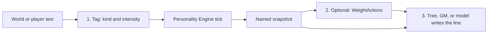

# Language models as a host

Personality Engine does **not** call a language model, store prompts, or spend tokens. A game that uses a model can still **host** this library the same way a dialogue tree or Utility AI does: something happens, you tick, you read named numbers (and optional action weights), then writing, animation, or a chooser use those numbers.

This page is for that host. It is not an SDK for any vendor. Wiring, save/load, and `HostEvents` stay in [Hosting](HOSTING.md). Design uses that are not model-specific stay in [Applying it in games](APPLICATIONS.md).

## Why plug it in

A language model is good at **lines**. It is a poor mood system. If you ask it to remember every hit, insult, and gift, you pay for that history on every call, and the same companion will “forget” to be angry after a long scene.

Personality Engine keeps **affect over time** as a small bag of named floats: how open this person is, how wound-up they are this minute, whether they are angry at someone, whether they still like `kin`. You persist that bag with the save. Between generations you `Tick` for free. When you do generate, you send a **short scene** plus **current channels** (and, if you use them, ranked moves)—not the combat log.

That does not make generation cheap. It makes **affect tracking** cheap and stable so the model does not have to be the memory of every punch.

## What the library will not do

- Write or rewrite dialogue
- Infer that a hit was anger, or that a gift was gratitude (OCC is **host-tagged**; something must choose the kind and intensity)
- Rank actions the host never listed
- Diagnose a player, score a test, or ship a clinic ([Disclaimer](../DISCLAIMER.md))

A model may sit **outside** as the thing that tags events or writes a line. It is never a required provider. See the [charter](CHARTER.md).

## Three plugs

Use one, two, or all three. Omit any layer you do not need; missing channels are absent, not errors.



**1. Tagger.** Combat, a designer, a cheap classifier, or a model maps “what just happened” onto a `HostEvents` helper (or a `WorldEvent` kind you already use). The engine does not read the sentence. Example: player insult → `HostEvents.Anger("rival")`; threat in the room → `HostEvents.Threat(0.7f)`. Fortune-of-others and compounds still need **you** (or the model) to choose HappyFor vs Gloat, Anger vs Distress. Liking is not inferred.

**2. State.** `Tick` on events and on idle frames so feelings decay. `Export` / `Import` at save boundaries so you do not replay the whole session into the prompt. Snapshot floats alone are not a full save; see [Hosting](HOSTING.md).

**3. Writer.** Two honest patterns:

- **Rank, then realize (fits this library best).** Candidate speech acts are action ids you already allow (`stay`, `leave`, `haggle`). `WeightActions` tints them. The host Pick (or you) chooses. A model, if you use one, writes **that** move—not a free-form rant that ignores the weights.
- **Condition the prompt.** Put a **small** set of current channels into the system prompt so the line matches mood and traits. Do this **with** ranked moves when you can. Numbers alone in a prompt can be ignored.

The VTT and companion examples in [Applying it in games](APPLICATIONS.md) are the same loop with a human GM or authored lines instead of a model.

## What to send a model

Keep it small and labeled.

**Do send**

- Who is speaking, who they are speaking to, and what just happened **in this beat** (one or two sentences)
- The channels you actually authored against, with names and ranges. Typical default-stack reads:
  - `personality.ocean.*` (0..1)
  - `mood.pad-mood.pleasure` / `arousal` / `dominance` (current mood, including OCC overlay when that mapping is on)
  - `emotion.occ.anger` (and other OCC keys you tick)
  - optional: `relationship.dyad.liking:{otherId}` in [-1, 1]
- A one-line legend: these are **game numbers**, not a psychometric score; 0.8 anger means “high on this character’s anger channel after your events and decay,” not a clinical label
- If you ranked moves: the winning action id, or the top two weights

**Do not send**

- Every historical tick or the full persist blob
- Every channel in the snapshot if the scene only needs mood and one emotion
- Inventory item text, test questions, or “this NPC has a disorder”
- A second copy of the scene in the user message and the system prompt

Idle `Tick(dt)` still matters when the player is silent. Visual-novel “initiator when the player says nothing” is the same idea: state moves without a new line.

## A thin host sketch

No HTTP, no vendor SDK. Your game owns the model call. `GetOrDefault` is 0 when the channel is absent.

```csharp
// 1. Tag (combat, UI, or a model that only returns a kind)
engine.Tick(HostEvents.Anger("rival", 0.8f), dt);

// 2. State the writer is allowed to see
var snap = engine.Snapshot;
var anger = snap.GetOrDefault("emotion.occ.anger");
var arousal = snap.GetOrDefault("mood.pad-mood.arousal");

// 3. Rank moves you already allow, then generate or play that line
var tints = engine.WeightActions(new[] { "stay", "pause", "leave" });
```

Fold `tints` into the chooser you already have (`HostChooser` in [Hosting](HOSTING.md)). Then either play authored text for `leave`, or ask a model to write **only** a leave line given the snapshot slice above.

## Pitfalls

- **Treating 0.8 as calibrated fury.** Gains and decay are **project convention** unless a citation says otherwise. Tell the model the range, or it will invent a scale.
- **Skipping the tag.** If nothing calls `Tick` with an event, the snapshot will not “notice” the insult. The model cannot push numbers into PE by talking about anger in prose.
- **Letting the model ignore `WeightActions`.** Prompt-only hosts drift. Prefer pick-then-realize.
- **Using the snapshot as a save file.** Rebuild the same composition, then `Import`. Tick 0 after load. Details: [Hosting](HOSTING.md).
- **Dual brains.** If a behavior tree Picks and a weighter also Picks, they fight. PE tints; the host Picks. Same rule if a model is choosing the move: one chooser.

## Not in this library

Vendor clients, prompt templates, and token I/O stay **out of this repository**. A later game can wrap PE; that wrapper is the game, not a Personality Engine provider. See [Roadmap](ROADMAP.md).
