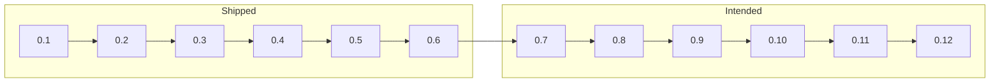

# Roadmap

Personality Engine is modular middleware for games: you tell it what happened, it hands back **named numbers**, and animation, AI, UI, and writing use those numbers. You turn on only the layers a character needs. Every provider cites an academic source. There is no language model inside the library. It is not a psychological test; see [Disclaimer](../DISCLAIMER.md).

This page is **direction**, not a contract. Minor versions may land in a different order. Patch releases fix and explain without adding a layer. A **1.0** cut means the host-facing contract (snapshot keys, event kinds, composition) is ready to freeze. There is no date for that.

Current published library: **0.6.2**. History: [Changelog](../CHANGELOG.md). Downloads: [Releases](https://github.com/RossSim/personality-engine/releases). NuGet: [GitHub Packages](https://github.com/RossSim/personality-engine/packages).

## Timeline

Shipped minors, then intended minors. The boxes are versions, not calendar dates. Current published cut is **0.6.2** (GitHub Packages publish; docs only on 0.6.1 API).

After 0.12: extras without a minor yet, then a 1.0 contract freeze when those layers have had a chance to settle.

## Shipped

| Version | What a host got |
| --- | --- |
| 0.1 | Pipeline, OCEAN, meaning, learning, cognition, identity |
| 0.2 | PAD mood dynamics and OCC emotion |
| 0.3 | Console and timeline hosts; tests on every push |
| 0.4 | Save/load, idle ticks, named events, Utility AI tint (the host still picks) |
| 0.5 | Fortune-of-others, pairwise liking, approach/avoid tint |
| 0.6 | Compound OCC (anger, gratitude, and kin). **0.6.1:** plain-language docs and a playable examples host |

Patches live under those minors. They do not add layers.

## Intended next

Each of these is an optional layer or provider. Omit it and those channels stay absent.

| Version | What a host would get |
| --- | --- |
| 0.7 | Personality beyond five traits: HEXACO (including Honesty-Humility), with Dark Triad as an optional supplement |
| 0.8 | Values: Schwartz: what a character will not trade away |
| 0.9 | Morality: Moral Foundations: what counts as a violation |
| 0.10 | Motives: McClelland (achievement, affiliation, power), then Self-Determination Theory beside it |
| 0.11 | Relationship beyond liking: attachment working models, then Heider triads |
| 0.12 | Goals, standards, and attitudes so OCC can appraise an event, not only accept a host tag. Host-tagged emotion stays valid. |

## Later, not given a minor yet

Tracked as future epics in the private tracker (no ticket ids in this repo):

| Theme | Cited direction | Layer |
| --- | --- | --- |
| Personality supplements | HEXACO (incl. Honesty-Humility), Dark Triad, BFAS aspects | personality |
| Temperament types | Thomas & Chess easy / difficult / slow-to-warm-up → trait bands; Mehrabian temperament PAD bias | personality |
| Values | Schwartz: what a character will not trade away | values |
| Morality | Moral Foundations: what counts as a violation | morality |
| Motives | McClelland (achievement, affiliation, power); Self-Determination Theory beside it | motives |
| Vocational interest | Holland RIASEC: vocation fit, not job IQ tables | motives / vocation |
| Relationship beyond liking | Attachment working models; Heider triads | relationship |
| OCC goals and standards | Appraise events, not only host tags; host-tagged emotion stays valid | emotion |
| Cognitive ability domains | Sternberg triarchic (analytic / creative / practical): domains, not a g or IQ channel | cognition |
| Agency and culture | Bandura self-efficacy; Gray BIS/BAS; Higgins promotion/prevention; Gelfand tightness–looseness on factions | personality / culture |
| C++ core parity | Same host contract as C# (snapshot keys, events, persist) | infrastructure |

Also on the “later” list without a dedicated epic yet:

- Gardner multiple intelligences (only if scoped and cited on a child ticket)
- Neo-Piagetian revisions (Case, Pascual-Leone) as sibling cognition providers

After 0.12 and the rows above have settled: extras without a minor yet, then a **1.0** contract freeze.

## Companion project (not this repo)

**Archetypes** ([github.com/RossSim/archetypes](https://github.com/RossSim/archetypes)): preset catalogs (profession, temperament, fantasy clan) that map into PE constructor args (`OceanTraits`, Piaget stage, operant seeds, enabled providers). Not new `IAffectProvider` implementations. Presets use cited knobs per field (cognitive stage, operant history, trait bands), not a single IQ score. Real-world race or ethnicity presets are out of scope for the public catalog.

## Under consideration

- A C++ port of the core with the same host contract as C# (named snapshot keys, events, persist). C# stays the Unity path. Engine plugins (Unreal, Godot) would come after that port, not in it.

## Not on this roadmap

- Maslow as a hunger stack (the host already simulates food and rest; a hierarchy is a poor fit for simultaneous channels)
- Deming’s management points as personality
- Type inventories, including MBTI
- IQ, g, or WAIS-style composite scores as a provider channel
- Profession or fantasy-clan preset tables (companion Archetypes repo)
- Race-based or real-world demographic cognitive rank presets
- A language model in the core (a game that uses a model can still host this library: [Language models as a host](LANGUAGE_MODELS.md))
- A clinic, diagnostic, or copyrighted item set

Where it goes in a game: [Applying it in games](APPLICATIONS.md). How to tick and save: [Hosting](HOSTING.md). Beside a language model (the model stays outside): [Language models as a host](LANGUAGE_MODELS.md). A Unity conversation-host sketch with a local model: [Lampwick](LAMPWICK.md). Preset authoring: [Archetypes](https://github.com/RossSim/archetypes). Unity adapter and macOS playable: [NPC-demo](https://github.com/RossSim/NPC-demo).
