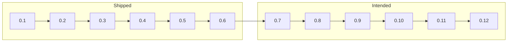

# Roadmap

Personality Engine is modular middleware for games: you tell it what happened, it hands back **named numbers**, and animation, AI, UI, and writing use those numbers. You turn on only the layers a character needs. Every provider cites an academic source. There is no language model inside the library. It is not a psychological test; see [Disclaimer](../DISCLAIMER.md).

This page is **direction**, not a contract. Minor versions may land in a different order. Patch releases fix and explain without adding a layer. A **1.0** cut means the host-facing contract (snapshot keys, event kinds, composition) is ready to freeze. There is no date for that.

Current published library: **0.6.1**. History: [Changelog](../CHANGELOG.md). Downloads: [Releases](https://github.com/RossSim/personality-engine/releases).

## Timeline

Shipped minors, then intended minors. The boxes are versions, not calendar dates. Current published cut is **0.6.1** (a patch on 0.6).

After 0.12: extras without a minor yet, then a 1.0 contract freeze when those layers have had a chance to settle.

## Shipped

| Version | What a host got |
| --- | --- |
| 0.1 | Pipeline, OCEAN, meaning, learning, cognition, identity |
| 0.2 | PAD mood dynamics and OCC emotion |
| 0.3 | Console and timeline hosts; tests on every push |
| 0.4 | Save/load, idle ticks, named events, Utility AI tint (the host still picks) |
| 0.5 | Fortune-of-others, pairwise liking, approach/avoid tint |
| 0.6 | Compound OCC (anger, gratitude, and kin). **0.6.1:** plain-language docs and a playable examples host |

Patches live under those minors. They do not add layers.

## Intended next

Each of these is an optional layer or provider. Omit it and those channels stay absent.

| Version | What a host would get |
| --- | --- |
| 0.7 | Personality beyond five traits: HEXACO (including Honesty-Humility), with Dark Triad as an optional supplement |
| 0.8 | Values: Schwartz — what a character will not trade away |
| 0.9 | Morality: Moral Foundations — what counts as a violation |
| 0.10 | Motives: McClelland (achievement, affiliation, power), then Self-Determination Theory beside it |
| 0.11 | Relationship beyond liking: attachment working models, then Heider triads |
| 0.12 | Goals, standards, and attitudes so OCC can appraise an event, not only accept a host tag. Host-tagged emotion stays valid. |

## Later, not given a minor yet

- Aspect-level Big Five, so a paper that needs those scores can be mapped without faking them from five domain traits
- Self-efficacy (will they even try — distinct from what has paid off)
- Approach vs inhibition as process personality
- Promotion vs prevention for quest framing
- Tight vs loose culture on a **faction** instance, not on every NPC

## Not on this roadmap

- Maslow as a hunger stack (the host already simulates food and rest; a hierarchy is a poor fit for simultaneous channels)
- Deming’s management points as personality
- Type inventories, including MBTI
- A language model in the core (a game that uses a model can still host this library: [Language models as a host](LANGUAGE_MODELS.md))
- A clinic, diagnostic, or copyrighted item set

Where it goes in a game: [Applying it in games](APPLICATIONS.md). How to tick and save: [Hosting](HOSTING.md). Beside a language model (the model stays outside): [Language models as a host](LANGUAGE_MODELS.md).
